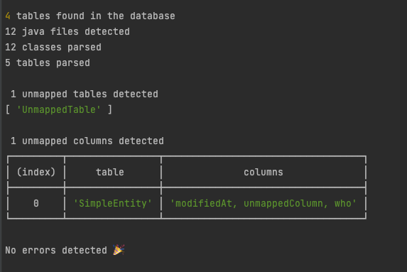

# hibernate-unmapped-objects

[](https://github.com/detomarco/hibernate-unmapped-objects/actions/workflows/publish.yml)
[](https://github.com/detomarco/hibernate-unmapped-objects/actions/workflows/lint.yml)
[](https://github.com/detomarco/hibernate-unmapped-objects/actions/workflows/codeql.yml)

[](https://codecov.io/gh/detomarco/hibernate-unmapped-objects)

Detect tables and columns that are no longer used in the code base

### Output


## Requirements

- Node 14

## Setup

1. Create config file
   - Rename `.huo.json.tmp` in `.huo.json` and fill with the required data 

## Run with Node

1. Install dependencies
```bash
npm install 
```
2. Run application
```shell
npm start   
```

